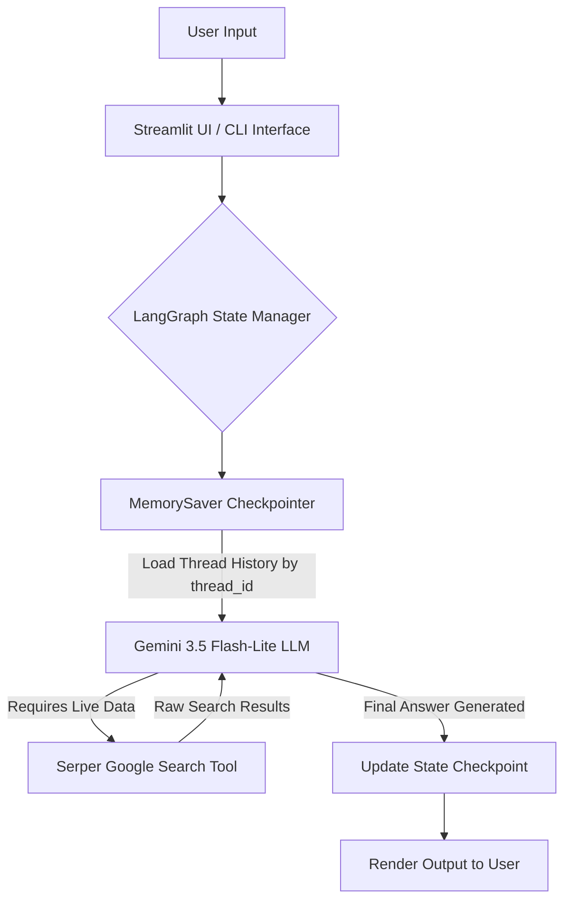

<div align="center">

# 🧠 SearchMind AI

**A Next-Generation Stateful Cognitive AI Search Agent & Multi-Session Intelligence Workspace**

[](https://www.python.org/)
[](https://www.langchain.com/langgraph)
[](https://www.langchain.com/)
[](https://aistudio.google.com/)
[](https://streamlit.io/)
[](https://serper.dev/)
[](LICENSE)

[Features](#-key-features) • [Architecture](#-architecture--react-workflow) • [Installation](#-installation--setup) • [Usage](#-running-the-application) • [Portfolio Showcase](#-engineering--interview-highlights)

</div>

---

## 📖 Overview

**SearchMind AI** is an enterprise-ready, stateful cognitive search agent powered by **LangGraph**, **Google Gemini 3.5**, **Serper Google Search**, and **Streamlit**. 

Traditional LLM wrappers suffer from key limitations: static knowledge cut-offs, lost context between turns, and flat single-threaded session models. **SearchMind AI** solves these challenges by combining real-time web retrieval via the Google Serper API with thread-isolated, persistent conversational state managed through **LangGraph MemorySaver checkpointers**. 

Encapsulated within a custom-designed **Glassmorphic Space-Themed Dashboard**, SearchMind AI delivers a smooth ChatGPT-like multi-session chat experience alongside a standalone terminal CLI.

---

## ✨ Key Features

### 🔍 Real-Time Web Intelligence
* **Live Google Search**: Powered by `GoogleSerperAPIWrapper` to fetch real-time news, current market prices, weather updates, and live factual data.
* **ReAct Agent Loop**: Dynamically decides when to query the web based on conversation intent versus relying on internal LLM parametric memory.

### 🧠 Persistent Stateful Thread Memory
* **LangGraph Pregel Graph Execution**: Built on modern graph architecture (`create_agent`) rather than legacy linear chains.
* **Thread-Isolated Sessions**: State checkpointer (`MemorySaver`) maps conversation state securely to unique session UUIDs (`thread_id`).
* **Zero Context Loss**: Preserves full message history across turns without requiring manually appended list buffers in memory.

### 🎛️ Multi-Session Chat Manager
* **Sidebar Conversation History**: Create new chat threads, switch between active sessions dynamically, and delete old chats on the fly.
* **Auto-Generating Session Identifiers**: Automatically tracks active threads (`Chat Session #1`, `Chat Session #2`) with visual active indicators (`📍`).
* **Thread Metadata Inspection**: View live UUID thread keys inside an expandable technical sidebar inspector.

### 🎨 Premium Glassmorphic UI/UX
* **Dark Space Aesthetics**: Handcrafted CSS featuring deep radial space gradients (`#090615` to `#04020a`), glassmorphic containers, and backdrop blur filters.
* **Custom Typography**: Integrated Google Font **Outfit** with optimized line heights, active shadow elevations, and subtle micro-transitions.
* **Distinct Message Bubbles**: Custom-styled user prompt bubbles (Indigo/Violet glow) and assistant response cards (Dark Glass).
* **Responsive Scrollbars & Controls**: Custom violet scrollbars, glowing chat inputs, and styled sidebar controls.

### 🖥️ Dual Execution Engines
* **Streamlit Web GUI ([app.py](file:///c:/Users/hp/OneDrive/Desktop/AI%20AGENT/app.py))**: Full-featured web application with multi-session support.
* **Interactive Terminal CLI ([agent.py](file:///c:/Users/hp/OneDrive/Desktop/AI%20AGENT/agent.py))**: Lightweight, fast command-line chatbot loop for headless environments.
* **Jupyter Notebook Sandbox ([agent_test.ipynb](file:///c:/Users/hp/OneDrive/Desktop/AI%20AGENT/agent_test.ipynb))**: Cell-by-cell execution environment for rapid prompt and tool prototyping.

---

## 🛠️ Architecture & ReAct Workflow

SearchMind AI operates on the **Reasoning and Action (ReAct)** design pattern built atop LangGraph's state graph runtime.



### System Component Breakdown

| Layer | Component | Description |
| :--- | :--- | :--- |
| **User Interface** | Streamlit + Custom CSS | Glassmorphic web app with thread manager, session state retention, & custom styling. |
| **Agent Framework** | LangGraph & LangChain | Graph execution runtime orchestrating model calls, tool execution, and state checkpoints. |
| **LLM Engine** | `gemini-3.5-flash-lite` | Google Generative AI model optimized for low latency and high API rate-limit resilience. |
| **Search Provider** | Google Serper API | Lightweight wrapper providing fast, structured Google Search JSON responses. |
| **Memory Checkpoint** | `MemorySaver` | Key-value thread checkpointer maintaining multi-turn context per `thread_id`. |

---

## 📁 Repository Structure

```
AI AGENT/
├── 📄 app.py                # Streamlit Web UI with Glassmorphic CSS & Multi-session Chat Manager
├── 📄 agent.py              # Lightweight Terminal CLI Chatbot with thread memory loop
├── 📓 agent_test.ipynb      # Jupyter Notebook for testing and prototyping agent state
├── 📄 requirements.txt      # Python package dependencies
├── 🔐 .env                  # Environment variables file (API Keys configuration)
├── 🙈 .gitignore            # Git ignore rules for virtualenv and env files
└── 📘 README.md             # Project documentation
```

---

## ⚙️ Installation & Setup

### 1. Prerequisites
Ensure you have the following installed:
* **Python 3.11** or higher
* **Google Gemini API Key** (Get free key from [Google AI Studio](https://aistudio.google.com/))
* **Serper API Key** (Get free key from [Serper.dev](https://serper.dev/))

### 2. Clone the Repository & Configure Environment
Clone the project repository to your local machine:
```bash
git clone https://github.com/PrathmeshSalunkhe08/SearchMind-Ai.git
cd SearchMind-Ai
```

Create a `.env` file in the root directory:
```env
GOOGLE_API_KEY=your_gemini_api_key_here
SERPER_API_KEY=your_serper_api_key_here
```

### 3. Set Up Virtual Environment & Dependencies
Create and activate a virtual environment, then install the required packages:

**Windows (PowerShell):**
```powershell
python -m venv .venv
.\.venv\Scripts\Activate.ps1
pip install -r requirements.txt
```

**Linux / macOS:**
```bash
python3 -m venv .venv
source .venv/bin/activate
pip install -r requirements.txt
```

---

## 🚀 Running the Application

### Option A: Streamlit Web Application (Recommended)
Launch the interactive web interface:
```bash
streamlit run app.py
```
Open your browser and navigate to `http://localhost:8501`.

### Option B: Interactive Terminal CLI
Run the standalone command-line chatbot:
```bash
python agent.py
```
To exit the terminal session, type `exit`, `quit`, or `q`.

### Option C: Jupyter Notebook Prototyping
Open `agent_test.ipynb` inside VS Code or Jupyter Lab to inspect intermediate agent messages cell by cell.

---

## 💼 Engineering & Interview Showcase Highlights

If you are presenting **SearchMind AI** in a technical portfolio, resume, or system design interview, highlight these key technical accomplishments:

> [!TIP]
> **Key Architectural Takeaways for Technical Discussions**
> 1. **Graph-Based Execution vs. Legacy Chains**: Migrating from legacy `initialize_agent` to `create_agent` using LangGraph provides deterministic state transitions, native tool handling, and cleaner observability.
> 2. **State Checkpoint Thread Isolation**: Explaining how `MemorySaver` uses a database-like `thread_id` configuration (`config={"configurable": {"thread_id": ...}}`) demonstrates deep understanding of modern production agent state management.
> 3. **Cost-Efficient Model Strategy**: Selecting `gemini-3.5-flash-lite` balances zero-cost rate limits (429 errors on free tier endpoints) with rapid inference speed for live web search augmentation.
> 4. **Complex Response Sanitization**: Implementation of `clean_content()` handles non-standard multi-part Gemini content blocks (lists of text dicts) gracefully without rendering system JSON strings to the end user.

---

## 🛠️ Environment Configuration Reference

| Environment Variable | Required | Description | Obtain From |
| :--- | :---: | :--- | :--- |
| `GOOGLE_API_KEY` | **Yes** | API key for Gemini 3.5 LLM inference | [Google AI Studio](https://aistudio.google.com/) |
| `SERPER_API_KEY` | **Yes** | API key for Google Serper search tool | [Serper.dev](https://serper.dev/) |

---

## 🤝 Contributing

Contributions are welcome! If you'd like to improve SearchMind AI:
1. Fork the Repository.
2. Create a Feature Branch (`git checkout -b feature/AmazingFeature`).
3. Commit your changes (`git commit -m 'Add AmazingFeature'`).
4. Push to the Branch (`git push origin feature/AmazingFeature`).
5. Open a Pull Request.

---

## 📜 License

Distributed under the **MIT License**. See `LICENSE` for more information.

---

<div align="center">

**Built with ❤️ using LangGraph, Google Gemini, Serper & Streamlit**

</div>
