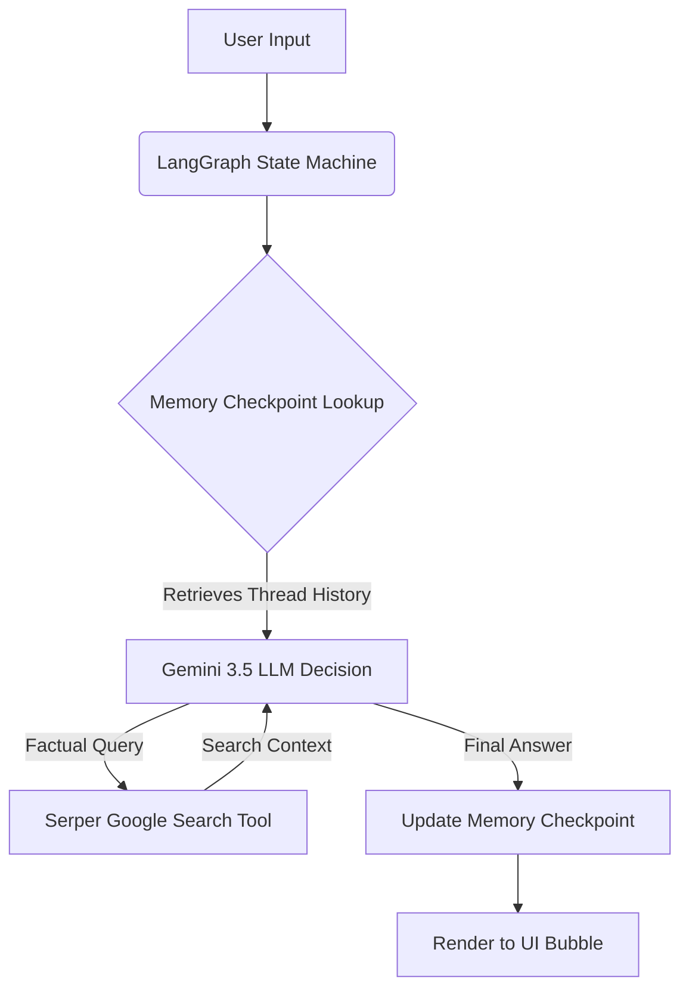

# 🧠 SearchMind AI Agent

A state-of-the-art stateful AI Search Agent sandbox built on **LangGraph**, **LangChain**, **Google Gemini 3.5**, and **Streamlit**. 

**SearchMind** is an advanced cognitive partner that dynamically utilizes real-time Google search tools to answer queries, powered by secure, thread-isolated conversational memory checkpointers.

---

## 🚀 Key Features

* **Real-Time Web Search**: Integrates Google Search via the **Serper API** to solve the knowledge cut-off problem for current facts, prices, and events.
* **Stateful Thread Memory**: Leverages **LangGraph MemorySaver** checkpointer. History is mapped securely to isolated `thread_id` sessions instead of basic local app-state lists.
* **Multi-Session Chat Manager**: Streamlit UI includes a sidebar to switch between multiple active chat sessions, start new threads, and delete unwanted chats, similar to professional LLM interfaces.
* **Premium Glassmorphic UI**: High-end user interface built using Streamlit and custom Vanilla CSS (featuring Google's Outfit font, smooth transitions, active shadow elevations, and clear user/bot message bubble separation).
* **CLI Chatbot Alternate**: Includes a command-line script (`agent.py`) that operates inside an infinite loop for server-side terminal usage.

---

## 🛠️ Architecture & Flow

The application follows the **ReAct (Reasoning and Action) Agent Pattern**. When a message is entered:



---

## ⚙️ Setup & Installation

### 1. Prerequisites
* **Python 3.11+** installed.
* API Keys for **Google Gemini** (via [Google AI Studio](https://aistudio.google.com/)) and **Serper API** (via [Serper.dev](https://serper.dev/)).

### 2. Clone & Initialize
Create a `.env` file in the root directory:
```env
GOOGLE_API_KEY=your_gemini_api_key_here
SERPER_API_KEY=your_serper_api_key_here
```

### 3. Install Dependencies
Activate your virtual environment and install the required packages:
```bash
# Example for Windows
.\.venv-1\Scripts\pip.exe install -r requirements.txt
```

---

## 🖥️ Running the Application

### Option A: The Streamlit Web UI (Recommended)
Launch the premium web interface:
```bash
.\.venv-1\Scripts\python.exe -m streamlit run app.py
```
*Accessible locally at `http://localhost:8501`*

### Option B: The CLI Chatbot
Run a lightweight conversation session directly inside your terminal:
```bash
.\.venv-1\Scripts\python.exe agent.py
```

### Option C: The Jupyter Sandbox Notebook
Experiment with cell-by-cell execution in [agent_test.ipynb](agent_test.ipynb).

---

## 🧩 Technologies Used

* **Core Framework**: LangChain Core / LangChain Community
* **State & Memory Manager**: LangGraph Pregel Graph (`MemorySaver` checkpointer)
* **LLM Engine**: ChatGoogleGenerativeAI (`gemini-3.5-flash-lite`)
* **Search Integration**: GoogleSerperAPIWrapper (Serper.dev)
* **Frontend Dashboard**: Streamlit Web UI + Custom CSS styling
* **Configuration**: Python Dotenv, UUID

---

## 💼 Interview Showcase Highlights

If you are showcasing **SearchMind** in a technical interview or on your resume, highlight these advanced implementations:
1. **LangGraph over LangChain**: Explaining that you used graph-based execution rather than legacy chains shows you write modern, production-grade agent workflows.
2. **Persistent Checkpointing**: Explain how `MemorySaver` preserves state records on a database key-value structure using `thread_id` configurations rather than losing context on page reloads.
3. **LLM Cost-Efficiency**: Highlight that the system utilizes `gemini-3.5-flash-lite` to resolve the quota limitations (429 rate limits) of the Google Developer API free tier while maintaining high response speeds.
