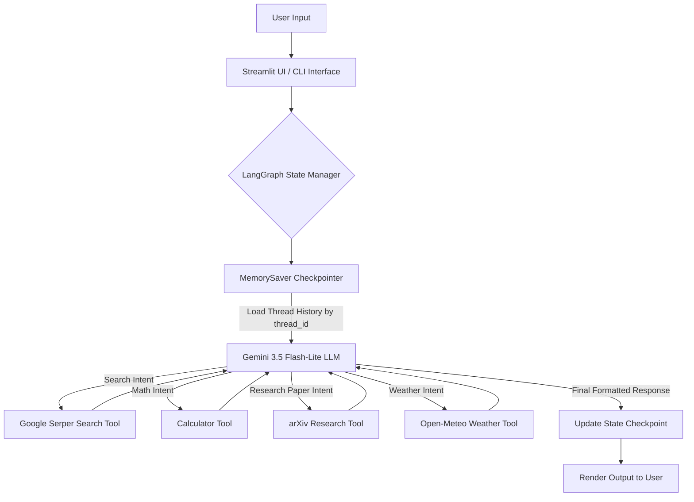

<div align="center">

# 🧠 SearchMind AI

**A Next-Generation Stateful Cognitive AI Agent & Multi-Tool Intelligence Workspace**

[](https://searchmind-ai-agent.streamlit.app)
[](https://www.python.org/)
[](https://www.langchain.com/langgraph)
[](https://www.langchain.com/)
[](https://aistudio.google.com/)
[](https://streamlit.io/)
[](https://serper.dev/)
[](https://github.com/PrathmeshSalunkhe08)
[](LICENSE)

[🚀 Live App Demo](https://searchmind-ai-agent.streamlit.app) • [Features](#-key-features--integrated-tools) • [Architecture](#-architecture--react-workflow) • [Installation](#-installation--setup) • [Usage](#-running-the-application) • [Author & Copyright](#-author--copyright)

</div>

---

## 🌐 Live Application
> **Try the deployed application live here:** [https://searchmind-ai-agent.streamlit.app](https://searchmind-ai-agent.streamlit.app)

---

## 📖 Overview

**SearchMind AI** is an enterprise-ready, stateful cognitive AI agent powered by **LangGraph**, **Google Gemini 3.5**, **Serper Google Search**, **arXiv Paper Search**, **Calculator**, **Open-Meteo Weather**, and **Streamlit**. 

Traditional LLM wrappers suffer from key limitations: static knowledge cut-offs, lost context between turns, and flat single-threaded session models. **SearchMind AI** solves these challenges by combining real-time web retrieval, scientific paper search, math computation, and live weather data with thread-isolated, persistent conversational state managed through **LangGraph MemorySaver checkpointers**. 

Encapsulated within a custom-designed **Glassmorphic Space-Themed Dashboard**, SearchMind AI delivers a smooth ChatGPT-like multi-session chat experience alongside a standalone terminal CLI.

---

## ✨ Key Features & Integrated Tools

### 🧰 Integrated Tools
SearchMind AI automatically selects and executes from **5 distinct tools**:

1. 🔍 **Real-Time Web Search (`search.run`)**: Powered by Google Serper API to fetch up-to-date news, current market prices, and live internet facts.
2. 🧮 **Mathematical Calculator (`calculator`)**: Evaluates mathematical expressions, trigonometric functions, logarithms, powers, and roots safely.
3. 📄 **Executive arXiv Research Search (`arxiv_search`)**: Searches scientific research papers with publication-grade Markdown formatting (headers, metadata badges, formatted abstracts, and direct PDF download links).
4. 🌤️ **Real-Time Weather Tool (`get_weather`)**: Resolves city names via Open-Meteo Geocoding and fetches live temperature (°C), humidity (%), and wind speed.
5. 🌐 **URL Web Page Reader & Summarizer (`summarize_url`)**: Powered by Trafilatura to fetch, extract, and read full main text content from any website URL.

### 🧠 Persistent Stateful Thread Memory
* **LangGraph Pregel Graph Execution**: Built on modern graph architecture (`create_agent`) rather than legacy linear chains.
* **Thread-Isolated Sessions**: State checkpointer (`MemorySaver`) maps conversation state securely to unique session UUIDs (`thread_id`).
* **Zero Context Loss**: Preserves full message history across turns without requiring manually appended list buffers in memory.

### 🎛️ Multi-Session Chat Manager
* **Sidebar Conversation History**: Create new chat threads, switch between active sessions dynamically, and delete old chats on the fly.
* **Auto-Generating Session Identifiers**: Automatically tracks active threads (`Chat Session #1`, `Chat Session #2`) with visual active indicators (`📍`).

### 🎨 Premium Glassmorphic UI/UX
* **Dark Space Aesthetics**: Handcrafted CSS featuring deep radial space gradients (`#090615` to `#04020a`), glassmorphic containers, and backdrop blur filters.
* **Custom Typography**: Integrated Google Font **Outfit** with optimized line heights, active shadow elevations, and subtle micro-transitions.

---

## 🛠️ Architecture & ReAct Workflow

SearchMind AI operates on the **Reasoning and Action (ReAct)** design pattern built atop LangGraph's state graph runtime.



### System Component Breakdown

| Layer | Component | Description |
| :--- | :--- | :--- |
| **User Interface** | Streamlit + Custom CSS | Glassmorphic web app with thread manager, session state retention, & custom styling. |
| **Agent Framework** | LangGraph & LangChain | Graph execution runtime orchestrating model calls, tool execution, and state checkpoints. |
| **LLM Engine** | `gemini-3.5-flash-lite` | Google Generative AI model optimized for low latency and high API rate-limit resilience. |
| **Tools Suite** | Search, Calculator, arXiv, Weather | 4 integrated tools providing web search, math calculations, research papers, and live weather. |
| **Memory Checkpoint** | `MemorySaver` | Key-value thread checkpointer maintaining multi-turn context per `thread_id`. |

---

## 📁 Repository Structure

```
AI AGENT/
├── 📄 app.py                # Streamlit Web UI with Glassmorphic CSS & Multi-session Chat Manager
├── 📄 agent.py              # Lightweight Terminal CLI Chatbot with thread memory loop
├── 📓 agent_test3.ipynb     # Jupyter Notebook sandbox for testing agent tools cell-by-cell
├── 📄 requirements.txt      # Python package dependencies
├── 🔐 .env                  # Environment variables file (API Keys configuration)
├── 🙈 .gitignore            # Git ignore rules for virtualenv and env files
└── 📘 README.md             # Project documentation
```

---

## ⚙️ Installation & Setup

### 1. Prerequisites
Ensure you have the following installed:
* **Python 3.11** or higher
* **Google Gemini API Key** (Get free key from [Google AI Studio](https://aistudio.google.com/))
* **Serper API Key** (Get free key from [Serper.dev](https://serper.dev/))

### 2. Clone the Repository & Configure Environment
Clone the project repository to your local machine:
```bash
git clone https://github.com/PrathmeshSalunkhe08/SearchMind-Ai.git
cd SearchMind-Ai
```

Create a `.env` file in the root directory:
```env
GOOGLE_API_KEY=your_gemini_api_key_here
SERPER_API_KEY=your_serper_api_key_here
```

### 3. Set Up Virtual Environment & Dependencies
Create and activate a virtual environment, then install the required packages:

**Windows (PowerShell):**
```powershell
python -m venv .venv
.\.venv\Scripts\Activate.ps1
pip install -r requirements.txt
```

**Linux / macOS:**
```bash
python3 -m venv .venv
source .venv/bin/activate
pip install -r requirements.txt
```

---

## 🚀 Running the Application

### Option A: Streamlit Web Application (Recommended)
Launch the interactive web interface:
```bash
streamlit run app.py
```
Open your browser and navigate to `http://localhost:8501`.

### Option B: Interactive Terminal CLI
Run the standalone command-line chatbot:
```bash
python agent.py
```
To exit the terminal session, type `exit`, `quit`, or `q`.

### Option C: Jupyter Notebook Prototyping
Open `agent_test3.ipynb` inside VS Code or Jupyter Lab to inspect intermediate agent messages cell by cell.

---

## 🛠️ Environment Configuration Reference

| Environment Variable | Required | Description | Obtain From |
| :--- | :---: | :--- | :--- |
| `GOOGLE_API_KEY` | **Yes** | API key for Gemini 3.5 LLM inference | [Google AI Studio](https://aistudio.google.com/) |
| `SERPER_API_KEY` | **Yes** | API key for Google Serper search tool | [Serper.dev](https://serper.dev/) |

---

## 👤 Author & Copyright

Designed, engineered, and maintained by **Prathmesh Salunkhe**.

* **GitHub**: [@PrathmeshSalunkhe08](https://github.com/PrathmeshSalunkhe08)
* **Repository**: [PrathmeshSalunkhe08/SearchMind-Ai](https://github.com/PrathmeshSalunkhe08/SearchMind-Ai)

---

## 📜 License & Copyright Notice

Copyright © 2026 **Prathmesh Salunkhe**. All Rights Reserved.

Distributed under the **MIT License**. See [`LICENSE`](LICENSE) for full details.

---

<div align="center">

**SearchMind AI © 2026 | Created with ❤️ by [Prathmesh Salunkhe](https://github.com/PrathmeshSalunkhe08)**

</div>
